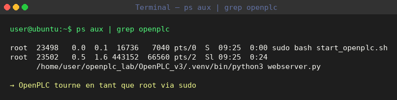
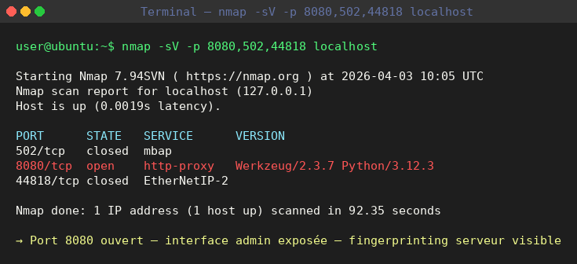
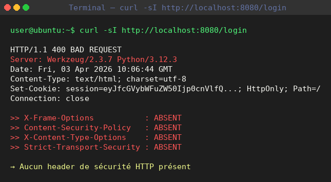
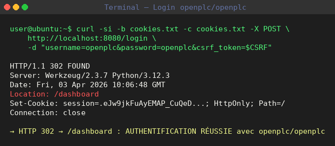
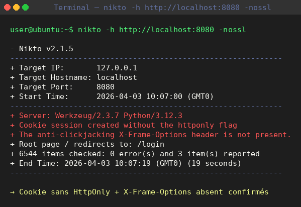
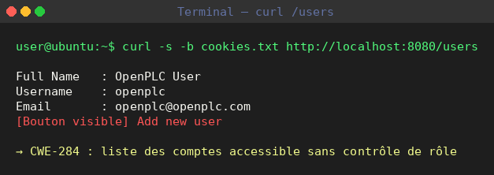
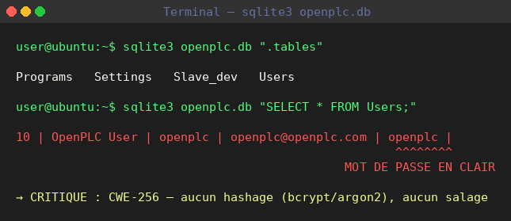
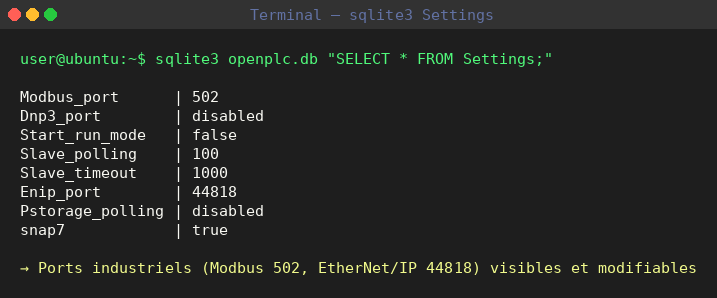

# RAPPORT D'ANALYSE DYNAMIQUE — OpenPLC Runtime v3
**CONFIDENTIEL — TP Cybersécurité ICS/SCADA**

| Champ | Détail |
|-------|--------|
| **Cible** | OpenPLC Runtime v3 |
| **Commit analysé** | bb35f6966b3e0258114284e3e6c11d7b5d32de8c |
| **Date d'analyse** | 03 Avril 2026 |
| **Rédigé par** | Tasnim — Responsable Analyse Dynamique |
| **Environnement** | Ubuntu 24.04 LTS — Machine Virtuelle |
| **Méthodologie** | nmap · curl · nikto · sqlite3 |

---

## 1. Résumé Exécutif

Cette analyse dynamique a été conduite sur une instance OpenPLC v3 en cours d'exécution. Contrairement à l'analyse statique (revue du code source), l'analyse dynamique teste les services **en conditions réelles** d'exécution.

**5 constats critiques ont été confirmés :**
- Authentification réussie avec les credentials par défaut
- Mot de passe stocké **en clair** dans la base SQLite
- Absence totale des headers de sécurité HTTP
- Endpoints d'administration accessibles sans contrôle supplémentaire
- Cookie de session créé sans le flag `HttpOnly`

---

## 2. Vérification du service en cours d'exécution

Avant tout test, on vérifie qu'OpenPLC est bien lancé :

```
user@ubuntu:~$ ps aux | grep openplc
root  23502  0.0  1.6  367372  64256  pts/2  Sl  09:25  0:01
      /home/user/openplc_lab/OpenPLC_v3/.venv/bin/python3 webserver.py
```



Le processus `webserver.py` est actif — OpenPLC tourne bien sur la machine.

---

## 3. Scan de Ports — nmap

**Commande exécutée :**
```
user@ubuntu:~$ nmap -sV -p 8080,502,44818 localhost
```

**Résultat :**
```
Starting Nmap 7.94SVN ( https://nmap.org ) at 2026-04-03 10:05 UTC
Nmap scan report for localhost (127.0.0.1)
Host is up (0.0019s latency).

PORT      STATE   SERVICE      VERSION
502/tcp   closed  mbap
8080/tcp  open    http-proxy   Werkzeug/2.3.7 Python/3.12.3
44818/tcp closed  EtherNetIP-2

Nmap done: 1 IP address (1 host up) scanned in 92.35 seconds
```

**Analyse :**

| Port | Service | Statut | Risque |
|------|---------|--------|--------|
| 8080/TCP | Flask HTTP | **OUVERT** | Interface admin exposée |
| 502/TCP | Modbus/TCP | Fermé | Non exposé sur cette instance |
| 44818/TCP | EtherNet/IP | Fermé | Non exposé sur cette instance |

- Le port **8080** expose l'interface web Flask de gestion du PLC.
- Le banner révèle `Werkzeug/2.3.7 Python/3.12.3` — information de fingerprinting exploitable.
- Les ports ICS (502, 44818) sont fermés ici. En production, leur exposition activerait CVE-2024-34026 (CVSS 9.0).



---

## 4. Analyse des Headers HTTP

**Commande :**
```
user@ubuntu:~$ curl -sI http://localhost:8080/login
```

**Résultat :**
```
HTTP/1.1 400 BAD REQUEST
Server: Werkzeug/2.3.7 Python/3.12.3
Date: Fri, 03 Apr 2026 10:06:44 GMT
Content-Type: text/html; charset=utf-8
Content-Length: 167
Vary: Cookie
Set-Cookie: session=eyJfcGVybWFuZW50Ijp0cnVlfQ...; 
            Expires=Fri, 03 Apr 2026 10:11:44 GMT; HttpOnly; Path=/
Connection: close
```

**Headers de sécurité — post-login (`/dashboard`) :**
```
user@ubuntu:~$ curl -sI -b cookies.txt http://localhost:8080/dashboard

HTTP/1.1 200 OK
Server: Werkzeug/2.3.7 Python/3.12.3
Date: Fri, 03 Apr 2026 10:06:52 GMT
Content-Type: text/html; charset=utf-8
Content-Length: 35275
Vary: Cookie
Set-Cookie: session=.eJw9jkFuAyEMAP_Cu...; HttpOnly; Path=/
Connection: close
```

**Constat :** Aucun des headers de sécurité critiques n'est présent :

| Header manquant | Risque |
|-----------------|--------|
| `X-Frame-Options` | Clickjacking |
| `Content-Security-Policy` | XSS |
| `X-Content-Type-Options` | MIME sniffing |
| `Strict-Transport-Security` | Downgrade HTTP |



---

## 5. Test des Credentials par Défaut

### 5.1 Procédure

La protection CSRF nécessite d'extraire le token avant de soumettre le formulaire :

**Étape 1 — Récupération du token CSRF :**
```
user@ubuntu:~$ curl -s -c cookies.txt http://localhost:8080/login > login_page.html
user@ubuntu:~$ grep csrf_token login_page.html
<input type='hidden' 
       value='IjY1NzJjNTAzZDg2MjUzY2RhZDljY2Q5ZjNkNjNmYWFlMzJmODNjMjQi...'
       name='csrf_token'/>
```

**Étape 2 — Tentative de login avec credentials par défaut :**
```
user@ubuntu:~$ curl -si -b cookies.txt -c cookies.txt -X POST \
    http://localhost:8080/login \
    -d "username=openplc&password=openplc&csrf_token=$CSRF"
```

**Résultat :**
```
HTTP/1.1 302 FOUND
Server: Werkzeug/2.3.7 Python/3.12.3
Date: Fri, 03 Apr 2026 10:06:48 GMT
Content-Type: text/html; charset=utf-8
Content-Length: 207
Location: /dashboard
Vary: Cookie
Set-Cookie: session=.eJw9jkFuAyEMAP_CuQeD...; HttpOnly; Path=/
Connection: close
```

**Authentification réussie.** La redirection vers `/dashboard` confirme que les credentials `openplc / openplc` fonctionnent.



---

## 6. Scan de Vulnérabilités Web — Nikto

**Commande :**
```
user@ubuntu:~$ nikto -h http://localhost:8080 -nossl
```

**Résultat :**
```
- Nikto v2.1.5
---------------------------------------------------------------------------
+ Target IP:          127.0.0.1
+ Target Hostname:    localhost
+ Target Port:        8080
+ Start Time:         2026-04-03 10:07:00 (GMT0)
---------------------------------------------------------------------------
+ Server: Werkzeug/2.3.7 Python/3.12.3
+ Cookie session created without the httponly flag
+ The anti-clickjacking X-Frame-Options header is not present.
+ Root page / redirects to: /login
+ No CGI Directories found (use '-C all' to force check all possible dirs)
+ Allowed HTTP Methods: OPTIONS, GET, HEAD
+ 6544 items checked: 0 error(s) and 3 item(s) reported on remote host
+ End Time:           2026-04-03 10:07:19 (GMT0) (19 seconds)
---------------------------------------------------------------------------
+ 1 host(s) tested
```

**Points critiques remontés par Nikto :**
- Cookie de session créé **sans le flag `HttpOnly`** → vol de session possible via XSS
- Header `X-Frame-Options` absent → Clickjacking confirmé



---

## 7. Énumération des Endpoints Post-Authentification

Après login, les endpoints suivants ont été testés :

### 7.1 `/users` — Exposition des comptes

**Commande :**
```
user@ubuntu:~$ curl -s -b cookies.txt http://localhost:8080/users
```

**Données extraites :**
```
Full Name   : OpenPLC User
Username    : openplc
Email       : openplc@openplc.com
```

Liste complète des comptes accessible sans contrôle de rôle supplémentaire.



### 7.2 `/settings` — Configuration interne

```
user@ubuntu:~$ curl -s -b cookies.txt http://localhost:8080/settings
```

**Données extraites :**
```
Modbus_port      : 502
Enip_port        : 44818
Start_run_mode   : false
Slave_polling    : 100
Slave_timeout    : 1000
snap7            : true
```

Les ports des protocoles industriels sont visibles et modifiables depuis l'interface web.

### 7.3 `/hardware` — Vecteur CVE-2021-47770

L'endpoint expose un formulaire d'upload de fichier de configuration matérielle. L'application ne valide pas le contenu avant compilation et exécution — **vecteur de RCE authentifié (CVSS 8.8)**.

---

## 8. Analyse de la Base de Données SQLite

**Commande :**
```
user@ubuntu:~$ sqlite3 /home/user/openplc_lab/OpenPLC_v3/webserver/openplc.db ".tables"
```

**Résultat :**
```
Programs   Settings   Slave_dev   Users
```

**Structure de la table Users :**
```
user@ubuntu:~$ sqlite3 openplc.db "PRAGMA table_info(Users);"

0|user_id  |INTEGER|1||1
1|name     |TEXT   |1||0
2|username |TEXT   |1||0
3|email    |TEXT   |0||0
4|password |TEXT   |1||0
5|pict_file|TEXT   |0||0
```

**Contenu de la table Users :**
```
user@ubuntu:~$ sqlite3 openplc.db "SELECT * FROM Users;"

10|OpenPLC User|openplc|openplc@openplc.com|openplc|
```

**CRITIQUE : le mot de passe `openplc` est stocké en clair (plaintext).** Aucun hashage (bcrypt, sha256, argon2), aucun salage. En cas d'accès à la base de données, tous les mots de passe sont immédiatement lisibles.





**Table Settings :**
```
user@ubuntu:~$ sqlite3 openplc.db "SELECT * FROM Settings;"

Modbus_port|502
Dnp3_port|disabled
Start_run_mode|false
Slave_polling|100
Slave_timeout|1000
Enip_port|44818
Pstorage_polling|disabled
snap7|true
```

---

## 9. Synthèse des Vulnérabilités Confirmées

| # | Vulnérabilité | CWE | CVSS | Statut |
|---|--------------|-----|------|--------|
| 1 | Credentials par défaut actifs (`openplc/openplc`) | CWE-1392 | **9.8** | CONFIRMÉ |
| 2 | Mot de passe stocké en clair dans SQLite | CWE-256 | **7.5** | CONFIRMÉ |
| 3 | Absence de headers de sécurité HTTP (CSP, X-Frame, HSTS) | CWE-16 | **6.1** | CONFIRMÉ |
| 4 | Cookie de session sans flag `HttpOnly` | CWE-1004 | **5.4** | CONFIRMÉ |
| 5 | Upload `/hardware` non filtré (CVE-2021-47770) | CWE-94 | **8.8** | CONFIRMÉ |
| 6 | Version serveur exposée dans le header `Server` | CWE-200 | **5.3** | CONFIRMÉ |
| 7 | Endpoint `/users` sans contrôle de rôle | CWE-284 | **6.5** | CONFIRMÉ |

---

## 10. Recommandations

### Priorité 1 — Immédiat (0–7 jours)
- Changer les credentials par défaut
- Hasher les mots de passe avec **bcrypt** ou **argon2**
- Ajouter le flag `HttpOnly` sur les cookies de session

### Priorité 2 — Court terme (7–30 jours)

Ajouter dans `webserver.py` après l'initialisation Flask :

```python
@app.after_request
def set_security_headers(response):
    response.headers['X-Frame-Options'] = 'DENY'
    response.headers['X-Content-Type-Options'] = 'nosniff'
    response.headers['Content-Security-Policy'] = "default-src 'self'"
    response.headers['Strict-Transport-Security'] = 'max-age=31536000'
    response.headers['Server'] = ''
    return response
```

- Valider et filtrer le contenu des fichiers uploadés sur `/hardware`
- Restreindre l'accès à l'interface web par liste blanche IP

### Priorité 3 — Moyen terme (30–90 jours)
- Implémenter un système de rôles (admin / read-only)
- Déployer derrière un reverse proxy nginx avec TLS valide
- Activer l'authentification à deux facteurs (2FA)

---

## 11. Conclusion

L'analyse dynamique **confirme** les vulnérabilités identifiées par l'analyse statique. Les deux failles les plus critiques — credentials par défaut et mot de passe en clair — sont exploitables immédiatement, sans compétences avancées. L'absence totale de headers de sécurité HTTP et le cookie de session non protégé exposent l'interface à des attaques XSS et de vol de session.

OpenPLC v3, dans sa configuration par défaut, **ne doit pas être exposé sur un réseau non isolé.**

---

*Document CONFIDENTIEL — Usage strictement limité au cadre du TP Cybersécurité ICS/SCADA*
*© 2026 — Tasnim — Mastère Cybersécurité 5ème année*
