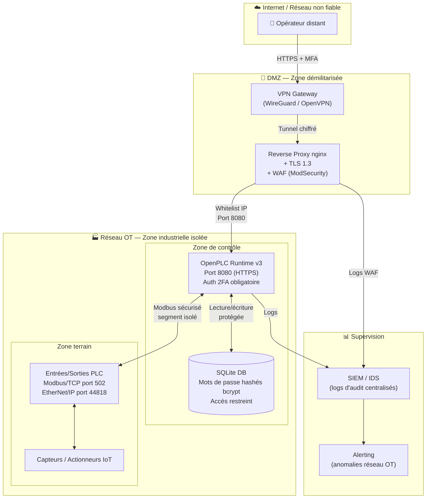

# Architecture Sécurisée IoT — OpenPLC v3
**Phase 1 — Security by Design**
*Mastère Cybersécurité 5ème année — TP Projet Final*

---

## Diagramme d'architecture sécurisée

---

## Actifs critiques identifiés

| Actif | Donnée sensible | Niveau de criticité |
|-------|----------------|---------------------|
| OpenPLC webserver | Credentials admin, config PLC | CRITIQUE |
| Base SQLite `openplc.db` | Mots de passe utilisateurs | CRITIQUE |
| Interface `/hardware` | Upload exécuté en root | CRITIQUE |
| Ports Modbus (502) / EtherNet/IP (44818) | Commandes industrielles | ÉLEVÉ |
| Header HTTP `Server` | Fingerprinting version | MOYEN |

---

## Surface d'attaque — Points d'entrée

| Point d'entrée | Protocole | Exposition actuelle | Exposition cible |
|---------------|-----------|---------------------|------------------|
| Interface web admin | HTTP:8080 | Publique, non chiffré | HTTPS:443, whitelist IP |
| Login | HTTP POST | Credentials par défaut | MFA + lockout |
| `/hardware` upload | HTTP POST | RCE non filtré | Validation + sandbox |
| Modbus/TCP | TCP:502 | Fermé (à maintenir fermé) | Réseau OT isolé uniquement |
| EtherNet/IP | TCP:44818 | Fermé (à maintenir fermé) | Réseau OT isolé uniquement |
| Base de données | Fichier local | Mot de passe en clair | bcrypt + accès restreint |

---

## Contraintes d'implantation

| Contrainte | Type | Mitigation proposée |
|-----------|------|---------------------|
| OpenPLC tourne en root | Technique/Sécurité | Utiliser un compte dédié avec privilèges minimaux |
| Flask serveur de dev (Werkzeug) | Technique | Remplacer par Gunicorn derrière nginx |
| Pas de TLS natif | Technique | Déployer un reverse proxy nginx avec certificat Let's Encrypt |
| Réseau OT non segmenté | Architecture | VLAN dédié OT, pare-feu industriel (Modbus-aware) |
| Pas de MFA | Humain/Sécurité | Intégrer TOTP (pyotp) ou LDAP avec 2FA |
| Coût infrastructure | Économique | Solutions open-source : nginx, WireGuard, Wazuh (SIEM) |

---

*Document rédigé dans le cadre du TP Cybersécurité ICS/SCADA — Mastère Cybersécurité 5ème année*
